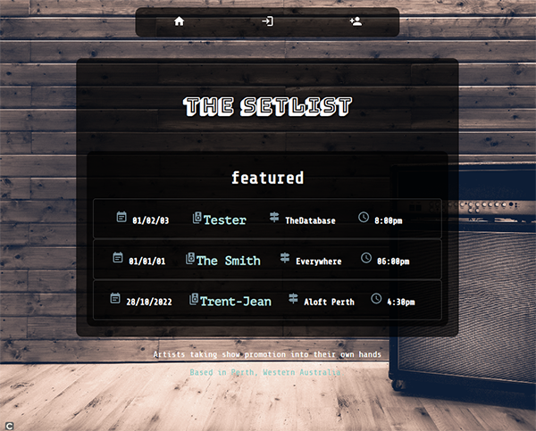

  
  # The Setlist
  
  ## Table of Contents
  * [Description](#description)
  * [Installation](#installation)
  * [Usage](#usage)
  * [Contributing](#contributing)
  * [Guidelines](#guidelines)
  * [Tests](#tests)
  * [License](#license)
  * [Questions](#questions)
---

  ## Description
  A Full-stack MERN application designed to help emerging local artists take show promotion into their own hands, by providing a central location where they can list details about their upcoming shows as well as create a profile that gives a broad outline of what their about and what to expect from their shows. Created using React, Express, and NoSQL it offers a sleek and intuitive interface for optimum user experience and comprehensive data storage.

  

  ## Installation
   None

  ## Usage
   Visit http://setlist.shiftleft.net.au

  ## Contributing
   Not seeking contributions

  ## Guidelines
   None

  ## Tests
   

  ## License
   Licensed under [MIT](https://opensource.org/licenses/MIT) 

   ---

  ## Questions
   For any questions you can find me at [GitHub](https://github.com/mleftwich) or email me at [mleftwich@live.com](mailto:mleftwich@live.com) 
